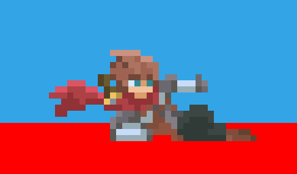

# Phaser 3 Arcade State Machine
[Live version](https://ganrmit.github.io/phaser-3-state-machine/)

This is my attempt at making a player movement state machine in Phaser 3.

## Available Commands

| Command | Description |
|---------|-------------|
| `npm install` | Install project dependencies |
| `npm run dev` | Builds project and open web server, watching for changes |
| `npm run build` | Builds code bundle with production settings  |
| `npm run serve` | Run a web server to serve built code bundle |

## Credits
- [Phaser 3 Typescript Starter](https://github.com/geocine/phaser3-rollup-typescript)
- [Animated Pixel Adventurer](https://rvros.itch.io/animated-pixel-hero)
- [Animated Pixel Slime](https://rvros.itch.io/pixel-art-animated-slime)
- [Game Programming Patterns - State](https://gameprogrammingpatterns.com/state.html)